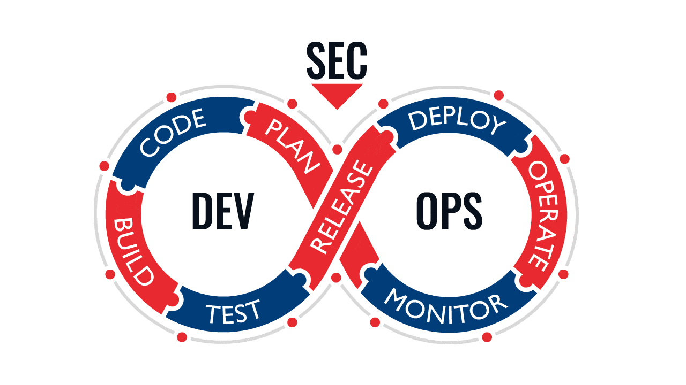

# Projet de fin d'étude de  Mastère DEVOPS & CLOUD 

[Ce Projet](https://gitlab.com/hackathon_solution_libre/projet-pro-m2) a pour objectif de Protéger votre infra avec une solution de cybersécurité intégrant Wazuh, Cortex et TheHive : une approche DEVOPS & CLOUD pour une sécurité renforcée.

## Introduction
 Face aux menaces de cybersécurité croissantes, il est essentiel de protéger vos actifs numériques et d'assurer la continuité des opérations. En combinant les avantages de `Wazuh`, `Cortex` et `TheHive`, la solution offre une approche complète de la sécurité.`Wazuh` surveille les activités suspectes, `Cortex` fournit une analyse avancée et `TheHive` facilite la gestion des incidents de sécurité.Notre approche DEVOPS simplifie la gestion de la sécurité, tandis que le cloud-hybride offre flexibilité et résilience.

### Philosophie
La philosophie de notre solution de cybersécurité intégrant  repose sur trois piliers fondamentaux : protection proactive, collaboration et évolutivité:
En combinant ces trois aspects clés - protection proactive, collaboration et évolutivité - nous visons à offrir une solution complète qui renforce la sécurité de votre entreprise, vous permettant de faire face aux menaces de cybersécurité avec confiance et tranquillité d'esprit.

## Installation
1. [x] AKS cluster dans Azure
2. [x] Wazuh cluster
3. [x] Traefik & Ingress Rules
4. [x] Wazuh-agent interne
4. [x] Prometheus cluster
5. [x] Grafana
6. [x] TheHive & Cortex 

### Prerequisites
Si vous avez déja un cluster AKS manager en locale passé cette étape.

1. [x] `Terraform` en local 
2. [x] Une VM de Gestion en locale 
3. [x] Un compte azure

### Préparation des ressources pour initialiser le projet
1. [x] Clonner le Projet [`git clone`]( https://github.com/devopsmbj/projetm2)
2. [x] Preparer une VM de gestion pour le Cluster Manager(Docker,kubectl,Ansible et Helm sont necessaire)
3. [x] Deployer l'infra dans le dossier [`Terraform-azure-AKS`](https://github.com/devopsmbj/projetm2/tree/main/Terraform-azure-AKS)
4. [x] Configuration de l'infra(Recuperer la config dans le tfstate generer)

### Deployement des ressources sur AKS () :
Suivre dans chaque dossier sa procedure d'installation et de configuration  
2. [x] [Prometheus](https://github.com/devopsmbj/projetm2/tree/main/prometheus)
1. [x] [Wazuh](https://github.com/devopsmbj/projetm2/tree/main/wazuh-kube)
3. [x] [Treafik](https://github.com/devopsmbj/projetm2/tree/main/treafik)
4. [x] [Configuration des regles pour utiliser une seule ip publique](https://github.com/devopsmbj/projetm2/tree/main/treafik/ingress-rule) 
5. [x] [TheHive et Cortex](https://github.com/devopsmbj/projetm2/tree/main/thehive-cortex) 
6. [x] [Wazuh agent pour surveiller l'état du AKS](https://github.com/devopsmbj/projetm2/tree/main/agent-wazuh)

🛂 **Warning**: La procédure d'installation de chaque composant est placé dans son README

