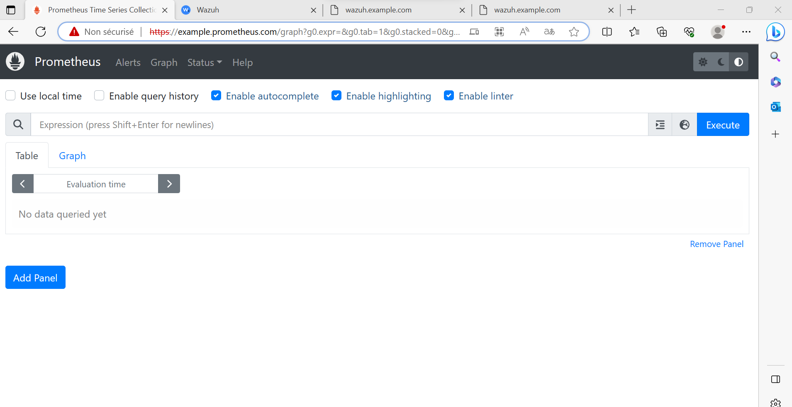

## ☸️ kubernetes prometheus Setup
Ces Manifest Kubebernetes vont creer un cluster Prometheus dans AKS.

## 🚀 Deployement dans AKS depuis la VM de gestion en local
1. [x] Se placer dans le dossier prometheus (pwd => prometheus)
2. [x] Créer les ressources prometheus dans AKS
    ```
    kubectl apply -f . 
   ```
3. [x]  Un cluster prometheus devrait etre crée dans le Namespace monitoring verification des ressources créer
   ```
    kubectl get all -n monitoring
   ```
4. [x]  Pour que le dashbord wazuh soit disponible sur `example.prometheus.com` placer vous dans traefik/ingress-rule et appliqué la l'ingress route 
   ```
    kubectl apply prometheus-ingressroute.yaml -n monitoring
   ```
#### veuillez à ce que l'address ip du `loadbalancer` traefik et l'adress DNS `example.prometheus.com` soit renseigné dans le fichier HOST



You can find the full tutorial from here--> [Kubernetes Monitoring setup Using Prometheus](https://devopscube.com/setup-prometheus-monitoring-on-kubernetes/)
## Other Manifest repos

Kube State metrics manifests: https://github.com/devopscube/kube-state-metrics-configs

Alert manager Manifests: https://github.com/bibinwilson/kubernetes-alert-manager

Grafana manifests: https://github.com/bibinwilson/kubernetes-grafana

Node Exporter manifests: https://github.com/bibinwilson/kubernetes-node-exporter


